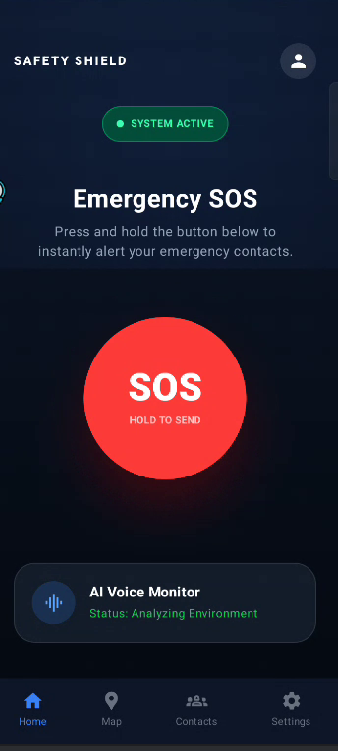
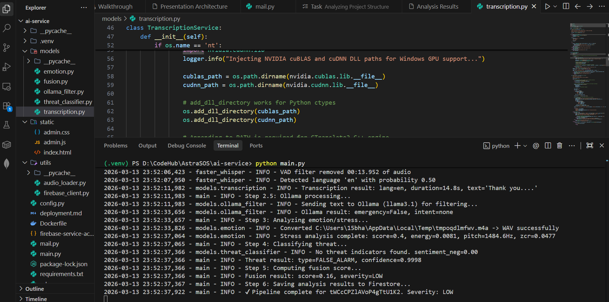
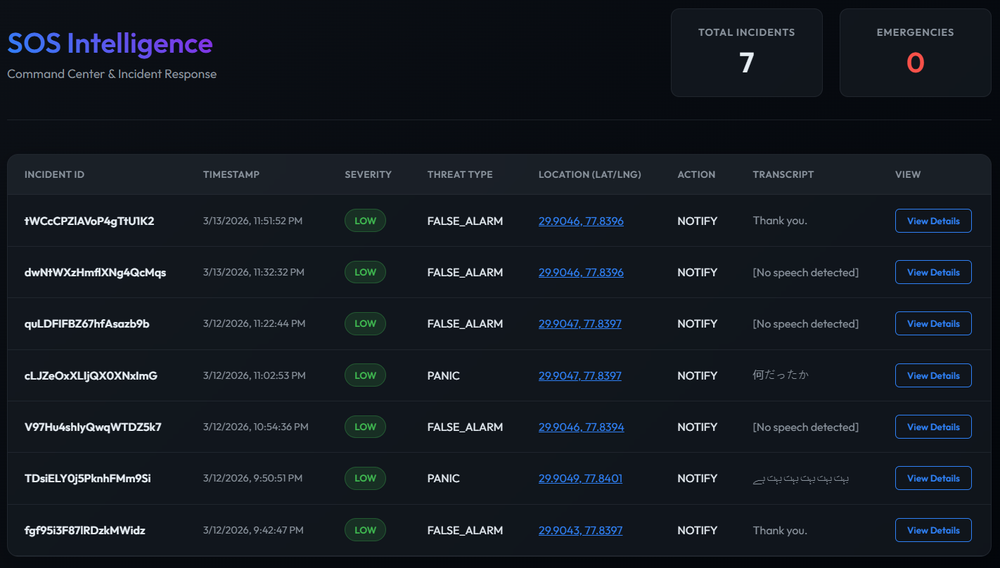

<div align="center">


# AstraSOS
### AI-Powered Emergency Detection System

[](https://github.com/Ashu-sosuke/Astra_SOS)
[](https://github.com/Ashu-sosuke/Astra_SOS)
[](https://github.com/Ashu-sosuke/Astra_SOS)
[](LICENSE)
[](https://github.com/Ashu-sosuke/Astra_SOS)

> *"The best emergency system is the one that works when you can't."*

</div>

---

## 🚨 The Problem

Most emergency apps assume the victim can **speak**, **unlock their phone**, and **make a call**.

Real emergencies don't work that way.

- **380M+** emergency calls go unanswered globally every year
- **43%** of assault victims are physically unable to speak during an incident
- Average police response time in India: **8–10 minutes**

**AstraSOS solves this by requiring zero user interaction after the initial SOS tap.**

---

## 💡 What is AstraSOS?

AstraSOS is a full-stack mobile safety application that detects emergency situations through **AI analysis of audio**, automatically triggering alerts and sharing live location — even when the victim cannot speak or interact with their phone.

---

## ✨ Features

- 🎙️ **One-Tap SOS** — Ambient audio recording starts instantly
- 🧠 **Multi-Model AI** — Speech, intent, and vocal stress analysed in parallel
- 📍 **Live GPS Tracking** — Real-time location broadcast to trusted contacts
- 🔔 **Auto Emergency Alerts** — SMS + push notifications triggered by severity score
- 🛡️ **Works Silently** — No typing, no calling, zero manual input required
- 📊 **Admin Dashboard** — Real-time incident monitoring interface

---

## 🏗️ System Architecture

```
┌─────────────────────────────────────────────────────────┐
│                   Android Mobile App                     │
│         (Kotlin · Jetpack Compose · MVVM · CameraX)     │
└────────────┬────────────────────────┬───────────────────┘
             │ 1. Upload Audio        │ 2. Create Incident Doc
             ▼                        ▼
┌────────────────────┐    ┌──────────────────────────┐
│  Firebase Storage  │    │     Firestore Database    │
│   (Audio Blobs)    │    │   (Incident Metadata +    │
│                    │    │    Live GPS Documents)    │
└────────────────────┘    └───────────┬──────────────┘
                                      │ 3. Triggers Listener
                                      ▼
                          ┌──────────────────────────┐
                          │    FastAPI AI Server      │
                          │   (Core Orchestrator)     │
                          └──┬──────┬──────┬────┬────┘
                             │      │      │    │
              ┌──────────────┘      │      │    └──────────────┐
              ▼                     ▼      ▼                   ▼
   ┌──────────────────┐  ┌────────────┐ ┌──────────────┐ ┌──────────────┐
   │  Whisper (STT)   │  │ Ollama LLM │ │   Librosa    │ │  DistilBERT  │
   │ Speech-to-Text   │  │Intent +    │ │ Vocal Stress │ │   Threat     │
   │  Transcription   │  │  Summary   │ │   Analysis   │ │Classification│
   └────────┬─────────┘  └─────┬──────┘ └──────┬───────┘ └──────┬───────┘
            │                  │               │                │
            └──────────────────┴───────────────┴────────────────┘
                                       │
                                       ▼
                          ┌──────────────────────────┐
                          │      Fusion Engine        │
                          │  Severity Score (0–100)   │
                          └───────────┬──────────────┘
                                      │ 4. Update Firestore Doc
                                      ▼
                          ┌──────────────────────────┐
                          │    Emergency Response     │
                          │  SMS · Push · GPS Share   │
                          └──────────────────────────┘
```

---

## 🔄 Workflow

### Step-by-Step Pipeline

```
User taps SOS
      │
      ▼
CameraX records 30–60s ambient audio
      │
      ▼
Audio uploaded to Firebase Storage (encrypted)
      │
      ▼
Firestore incident document created with metadata + GPS
      │
      ▼
Firestore listener triggers FastAPI server
      │
      ├──► Whisper        → Transcribes speech to text
      ├──► Ollama LLM     → Detects intent, keywords, threat phrases
      ├──► Librosa        → Extracts MFCC, pitch, energy (vocal stress)
      └──► DistilBERT     → Classifies threat category
                │
                ▼
         Fusion Engine combines all scores
                │
                ▼
         Severity Score generated (0–100)
                │
         ┌──────┴──────┐
         │             │
        LOW           HIGH
      (0–30)        (61–100)
    Log only     SMS + Alerts +
                 Live GPS share +
                Authority dispatch
```

### Severity Thresholds

| Score | Level | Action |
|-------|-------|--------|
| 0–30  | 🟢 Low | Incident logged only |
| 31–60 | 🟡 Medium | Alert trusted contacts + share location |
| 61–100 | 🔴 High | SMS + push + authority notification |

---

## 🛠️ Tech Stack

### Android Client
| Component | Technology |
|-----------|------------|
| Language | Kotlin |
| UI | Jetpack Compose |
| Architecture | MVVM + Repository Pattern |
| Audio | CameraX |
| Network | Retrofit + OkHttp |
| Real-time | Firestore Listeners |
| Local DB | Room |

### AI Backend
| Component | Technology |
|-----------|------------|
| Framework | Python · FastAPI |
| Speech-to-Text | OpenAI Whisper |
| Intent Detection | Ollama LLM |
| Audio Analysis | Librosa (MFCC · Pitch · Energy) |
| Threat Classification | DistilBERT |
| Score Fusion | Custom Fusion Engine |

### Cloud Infrastructure
| Component | Technology |
|-----------|------------|
| Audio Storage | Firebase Cloud Storage |
| Database | Firebase Firestore |
| Authentication | Firebase Auth |
| Real-time Sync | Firestore Listeners |

---

## 📱 Screenshots

> **Home Screen** — One-tap SOS with live status indicator



> **AI Processing View** — Real-time analysis progress



> **Alert Sent** — Contact notified with live GPS map


> **Admin Dashboard** — Real-time incident monitoring



---

## 🚀 Getting Started

### Prerequisites

- Android Studio Hedgehog or later
- Python 3.10+
- Firebase project set up
- Ollama installed locally or on server

### Android Setup

```bash
# Clone the repository
git clone https://github.com/Ashu-sosuke/Astra_SOS.git
cd Astra_SOS

# Open in Android Studio
# Add your google-services.json to /app directory
# Sync Gradle and run on device/emulator
```

### Backend Setup

```bash
# Navigate to backend directory
cd backend

# Create virtual environment
python -m venv venv
source venv/bin/activate  # Windows: venv\Scripts\activate

# Install dependencies
pip install -r requirements.txt

# Add Firebase service account key
# Place serviceAccountKey.json in /backend directory

# Start the FastAPI server
uvicorn main:app --reload --port 8000
```

### Environment Variables

Create a `.env` file in the backend directory:

```env
FIREBASE_CREDENTIALS=serviceAccountKey.json
OLLAMA_HOST=http://localhost:11434
WHISPER_MODEL=base
SEVERITY_HIGH_THRESHOLD=61
SEVERITY_MEDIUM_THRESHOLD=31
```

---

## 📁 Project Structure

```
Astra_SOS/
├── app/
│   ├── src/main/java/com/astrasos/
│   │   ├── ui/              # Jetpack Compose screens
│   │   ├── viewmodel/       # MVVM ViewModels
│   │   ├── repository/      # Data repositories
│   │   ├── data/            # Models + Room DB
│   │   └── service/         # Background SOS service
│   └── google-services.json
│
├── backend/
│   ├── main.py              # FastAPI entry point
│   ├── orchestrator.py      # AI pipeline coordinator
│   ├── models/
│   │   ├── whisper_stt.py   # Speech-to-text
│   │   ├── ollama_intent.py # Intent detection
│   │   ├── librosa_stress.py# Vocal stress analysis
│   │   └── bert_classify.py # Threat classification
│   ├── fusion_engine.py     # Severity score fusion
│   └── requirements.txt
│
└── README.md
```

---

## 🔭 Roadmap

### ✅ Phase 1 — Complete
- [x] Android app with one-tap SOS
- [x] Firebase Storage + Firestore integration
- [x] FastAPI AI pipeline (Whisper + Ollama + Librosa + DistilBERT)
- [x] Fusion Engine with severity scoring
- [x] Real-time GPS sharing
- [x] Trusted contact alert system

### 🔄 Phase 2 — In Progress
- [ ] WebSocket real-time streaming (sub-2s detection)
- [ ] Wearable device integration (Android Wear / Fitbit)
- [ ] Improved threat classification accuracy

### 🔭 Phase 3 — Planned
- [ ] Multi-language detection (Hindi, Spanish, French)
- [ ] Government emergency API integration (112 India)
- [ ] On-device AI inference for offline support

---

## 🤝 Contributing

Contributions, issues, and feature requests are welcome!

1. Fork the repository
2. Create your feature branch (`git checkout -b feature/AmazingFeature`)
3. Commit your changes (`git commit -m 'Add AmazingFeature'`)
4. Push to the branch (`git push origin feature/AmazingFeature`)
5. Open a Pull Request

---

## 👨‍💻 Author

**Ashutosh Kumar Bharti**
- GitHub: [@Ashu-sosuke](https://github.com/Ashu-sosuke)
- Project: [AstraSOS](https://github.com/Ashu-sosuke/Astra_SOS)

*First-year CSE student at Roorkee Institute of Technology*
*Open to Android / AI internship opportunities*

---

## 📄 License

This project is licensed under the MIT License — see the [LICENSE](LICENSE) file for details.

---

<div align="center">

**⭐ Star this repo if AstraSOS inspired you to build something that matters.**

*Built with purpose. Every second counts.*

</div>
